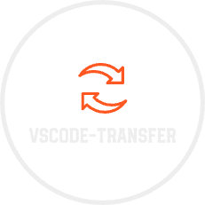

 <a href="./README.md">English</a> | 简体中文

# VSCode Transfer - 强大的内容转换扩展

**VSCode Transfer** 是一个轻量级且高效的 Visual Studio Code 扩展，旨在帮助开发者快速将选中的内容转换为多种格式。无论是处理 JSON、字符串还是命名规范，这个扩展都能通过多种强大的命令简化您的工作流程。

## 主要功能

- **JSON 格式化**：轻松将对象格式化为 JSON。
- **大小写转换**：将文本转换为大写或小写。
- **对象与字符串转换**：在对象和字符串之间无缝切换。
- **字符串操作**：一键反转字符串。
- **命名规范转换**：将文本转换为驼峰命名、帕斯卡命名（大驼峰）或连字符命名。
- **快速访问菜单**：通过便捷的 VS Code 菜单访问所有转换功能。

## 支持的命令

以下是所有支持的命令列表：

- **JSON 格式化**
  - `transfer.toJSON`: 将对象转换为 JSON 格式。
- **大小写转换**
  - `transfer.uppercase`: 将文本转换为大写。
  - `transfer.lowercase`: 将文本转换为小写。
- **对象与字符串转换**
  - `transfer.objToStr`: 将对象转换为字符串。
  - `transfer.strToObj`: 将字符串转换为对象。
- **字符串操作**
  - `transfer.reverse`: 反转选中的字符串。
- **命名规范转换**
  - `transfer.camel`: 将文本转换为驼峰命名。
  - `transfer.bigCamel`: 将文本转换为帕斯卡命名（大驼峰）。
  - `transfer.hyphen`: 将文本转换为连字符命名（kebab-case）。
- **快速访问**
  - `transfer.transfer`: 唤起 VSCode Transfer 菜单，快速执行转换操作。

## 为什么选择 VSCode Transfer？

- **提升效率**：通过自动化重复的文本转换任务节省时间。
- **开发者友好**：直观的命令和与 VS Code 的无缝集成。
- **可定制**：通过 VS Code 界面快速切换转换选项。

### 新功能：通过 VS Code 选项快速切换

最新更新引入了 **快速切换** 功能，允许用户直接通过 VS Code 界面在不同的转换选项之间切换。这一增强功能简化了应用转换的过程，无需手动选择命令。

## 安装

1. 在 VS Code 中打开扩展视图（macOS 使用 `Cmd+Shift+X`，Windows/Linux 使用 `Ctrl+Shift+X`）。
2. 搜索 `vscode-transfer`。
3. 点击 **安装** 将扩展添加到您的编辑器中。

## 使用方法

1. 在编辑器中选中需要转换的文本。
2. 右键选择 **vscode-transfer** 子菜单中的所需转换功能。
3. 或者，使用命令面板（macOS 使用 `Cmd+Shift+P`，Windows/Linux 使用 `Ctrl+Shift+P`），输入命令名称。

## 贡献

欢迎贡献！如果您遇到任何问题或有功能请求，请在 [GitHub](https://github.com/Simon-He95/vscode-transfer/issues) 上提交问题。

## :coffee: 支持项目

如果您觉得这个扩展对您有帮助，请考虑 [请我喝一杯咖啡](https://github.com/Simon-He95/sponsor) 来支持其开发。

## License

本项目基于 [MIT License](./license) 许可。
